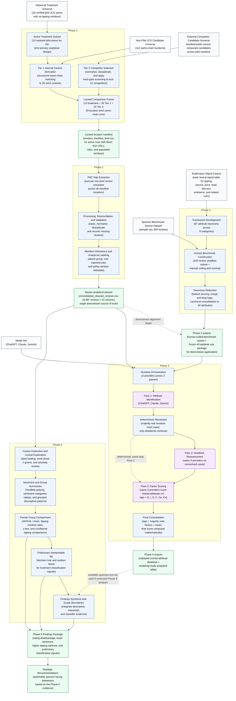

```mermaid
flowchart TD

    %% =========================
    %% EXTERNAL INPUTS
    %% =========================
    T18["Historical Treatment Universe<br/>(18 verified pilot JCS stores<br/>with no-tipping windows)"]:::data
    NP["Non-Pilot JCS Candidate Universe<br/>(112 same-chain locations)"]:::data
    EC["External Competitor Candidate Universe<br/>(audited public-source restaurant candidates<br/>across pilot markets)"]:::data

    C["Exploratory Signal Corpus<br/>(early lexical signal table for tipping,<br/>service, price, food, fairness,<br/>ambiance, and related cues)"]:::data
    S500["Sponsor Benchmark Source Dataset<br/>(sample.csv, 500 reviews)"]:::data
    MODELSET["Model Set<br/>(ChatGPT, Claude, Gemini)"]:::data

    %% =========================
    %% PHASE 1
    %% =========================
    subgraph P1["Phase 1"]
        direction TB

        T13["Active Treatment Subset<br/>(13 retained pilot stores for the<br/>strict primary analytical design)"]:::proc

        C1["Tier 1 Internal Control Derivation<br/>(structured same-chain matching<br/>to 26 strict controls)"]:::proc

        C2["Tier 2 Competitor Selection<br/>(normalize, deduplicate, and apply<br/>hard-gate screening to lock 22 competitors)"]:::proc

        FRAME1["Locked Comparison Frame<br/>(13 treatment + 26 Tier 1 + 22 Tier 2;<br/>39-location strict same-chain core)"]:::proc

        T13 --> C1 --> FRAME1
        C2 --> FRAME1
    end

    MAN["Locked location manifest<br/>(location_manifest_final.csv;<br/>61 active rows with direct /biz/ URLs,<br/>roles, and populated windows)"]:::output

    %% =========================
    %% PHASE 2
    %% =========================
    subgraph P2["Phase 2"]
        direction TB

        EXT["PAD Yelp Extraction<br/>(execute row-level review extraction<br/>across all manifest locations)"]:::proc

        PROC["Processing, Reconciliation, and Validation<br/>(clean, normalize, deduplicate,<br/>and recover missing reviews)"]:::proc

        LABEL["Manifest Inheritance and Analytical Labeling<br/>(attach group, role, matched pilot,<br/>and policy-window metadata)"]:::proc

        EXT --> PROC --> LABEL
    end

    MASTER["Master analytical dataset<br/>(consolidated_cleaned_reviews.csv;<br/>16,997 reviews × 42 columns;<br/>single downstream source of truth)"]:::output

    %% =========================
    %% PHASE 3
    %% =========================
    subgraph P3["Phase 3"]
        direction TB

        FRAME3["Framework Development<br/>(97-attribute taxonomy across<br/>9 categories)"]:::proc

        BENCH["Human Benchmark Construction<br/>(100-review stratified subset +<br/>manual coding and scoring)"]:::proc

        REDUCE["Taxonomy Reduction<br/>(feature pruning, merge and drop logic,<br/>canonical consolidation to 40 attributes)"]:::proc

        FRAME3 --> BENCH --> REDUCE
    end

    OUT3["Phase 3 outputs<br/>(human-coded benchmark assets +<br/>frozen 40-attribute rule package<br/>for downstream application)"]:::output

    %% =========================
    %% PHASE 4
    %% =========================
    subgraph P4["Phase 4"]
        direction TB

        ORCH["Runtime Orchestration<br/>(3 providers across 3 passes)"]:::proc

        P1RUN["Pass 1: Attribute Identification<br/>(ChatGPT, Claude, Gemini)"]:::llm

        RES["Deterministic Resolution<br/>(majority-rule resolves most cases;<br/>only deadlocks continue)"]:::proc

        P2RUN["Pass 2: Deadlock Reassessment<br/>(same 3 providers on unresolved cases)"]:::llm

        P3RUN["Pass 3: Factor Scoring<br/>(same 3 providers score locked attributes on:<br/>sign + D, I, S, C, Ce, Co)"]:::llm

        CONS["Final Consolidation<br/>(sign = majority vote;<br/>factors = mean;<br/>final score computed mathematically)"]:::proc

        ORCH --> P1RUN --> RES --> P2RUN --> P3RUN --> CONS
        RES -. "deterministic cases skip Pass 2" .-> P3RUN
    end

    OUT4["Phase 4 outputs<br/>(validated scored-attribute database +<br/>modeling-ready analytical table)"]:::output

    %% =========================
    %% PHASE 5
    %% =========================
    subgraph P5["Phase 5"]
        direction TB

        DESC["Corpus Inspection and Lexical Exploration<br/>(data loading, word cloud,<br/>n-grams, and anomaly review)"]:::proc

        SENT["Sentiment and Group Summaries<br/>(TextBlob polarity, sentiment categories,<br/>ratings, and grouped descriptive patterns)"]:::proc

        TEST["Formal Group Comparisons<br/>(ANOVA, t-tests, tipping-mention rates,<br/>z-test, and conditional tipping comparisons)"]:::proc

        ML["Preliminary Interpretable ML<br/>(decision tree and random forest<br/>for treatment-classification signals)"]:::proc

        SYN["Findings Synthesis and Scope Boundaries<br/>(integrate descriptive, inferential,<br/>and classifier evidence)"]:::proc

        DESC --> SENT --> TEST --> ML --> SYN
    end

    FIND["Phase 5 Findings Package<br/>(rating disadvantage, lower sentiment,<br/>higher tipping salience, and preliminary<br/>classification signals)"]:::output

    REC["Strategic Recommendations<br/>(actionable sponsor-facing takeaways<br/>based on the Phase 5 evidence)"]:::output

    %% =========================
    %% CROSS-PHASE HANDOFFS
    %% =========================
    T18 --> T13
    NP --> C1
    EC --> C2
    FRAME1 --> MAN

    MAN --> EXT
    LABEL --> MASTER

    C --> FRAME3
    S500 --> BENCH
    REDUCE --> OUT3
    MASTER -. "downstream alignment target" .-> OUT3

    MASTER --> ORCH
    OUT3 --> ORCH
    MODELSET --> ORCH
    CONS --> OUT4

    MASTER --> DESC
    OUT4 -. "available upstream but not used in executed Phase 5 analysis" .-> SYN
    TEST --> FIND
    ML --> FIND
    SYN --> FIND
    FIND --> REC

    %% =========================
    %% STYLING
    %% =========================
    classDef llm fill:#F6E9FF,stroke:#7B3FC6,stroke-width:1.4px,color:#111;
    classDef proc fill:#EEF4FF,stroke:#3B6FB6,stroke-width:1.2px,color:#111;
    classDef data fill:#F8FAFC,stroke:#5B6573,stroke-width:1.2px,color:#111;
    classDef output fill:#EAFBF0,stroke:#2E8B57,stroke-width:1.4px,color:#111;

    class T18,NP,EC,C,S500,MODELSET data;
    class T13,C1,C2,FRAME1,EXT,PROC,LABEL,FRAME3,BENCH,REDUCE,ORCH,RES,CONS,DESC,SENT,TEST,ML,SYN proc;
    class MAN,MASTER,OUT3,OUT4,FIND,REC output;
    class P1RUN,P2RUN,P3RUN llm;
```
