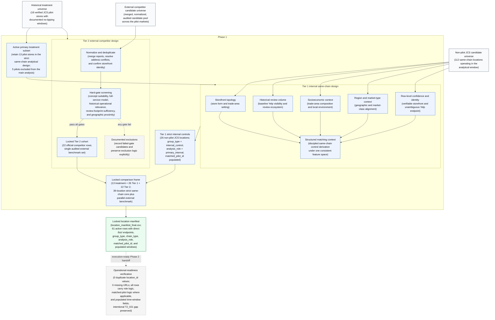

```mermaid
flowchart TD

    %% =========================
    %% EXTERNAL INPUTS
    %% =========================
    T18["Historical treatment universe<br/>(18 verified JCS pilot stores with<br/>documented no-tipping windows)"]:::data
    NP["Non-pilot JCS candidate universe<br/>(112 same-chain locations operating in the<br/>analytical window)"]:::data
    EC["External competitor candidate universe<br/>(merged, normalized, audited candidate pool<br/>across the pilot markets)"]:::data

    %% =========================
    %% PHASE 1
    %% =========================
    subgraph P1["Phase 1"]
        direction TB

        T13["Active primary treatment subset<br/>(retain 13 pilot stores in the strict<br/>same-chain analytical design;<br/>5 pilots excluded from the main analysis)"]:::proc

        subgraph MATCH["Tier 1 internal same-chain design"]
            direction TB

            V1["Storefront topology<br/>(store form and trade-area setting)"]:::proc
            V2["Historical review volume<br/>(baseline Yelp visibility and review ecosystem)"]:::proc
            V3["Socioeconomic context<br/>(trade-area composition and local environment)"]:::proc
            V4["Region and market-type context<br/>(geographic and market-class alignment)"]:::proc
            V5["Row-level confidence and identity<br/>(verifiable storefront and unambiguous Yelp endpoint)"]:::proc

            M["Structured matching context<br/>(discipled same-chain control derivation<br/>under one consistent feature space)"]:::proc

            V1 --> M
            V2 --> M
            V3 --> M
            V4 --> M
            V5 --> M
        end

        C1["Tier 1 strict internal controls<br/>(26 non-pilot JCS locations;<br/>group_type = internal_control,<br/>analysis_role = primary_internal,<br/>matched_pilot_id populated)"]:::proc

        subgraph COMP["Tier 2 external competitor design"]
            direction TB

            E1["Normalize and deduplicate<br/>(merge reports, resolve address conflicts,<br/>and confirm storefront identity)"]:::proc

            E2["Hard-gate screening<br/>(concept suitability, full-service model,<br/>historical operational relevance,<br/>review-footprint sufficiency,<br/>and geographic proximity)"]:::proc

            E2X["Documented exclusions<br/>(record failed-gate candidates and<br/>preserve exclusion logic explicitly)"]:::note

            E7["Locked Tier 2 cohort<br/>(22 official competitor rows;<br/>single audited external benchmark set)"]:::proc

            E1 --> E2
            E2 -- "pass all gates" --> E7
            E2 -. "any gate fail" .-> E2X
        end

        FRAME["Locked comparison frame<br/>(13 treatment + 26 Tier 1 + 22 Tier 2;<br/>39-location strict same-chain core plus<br/>parallel external benchmark)"]:::proc

        T13 --> MATCH --> C1 --> FRAME
        E7 --> FRAME
    end

    MAN["Locked location manifest<br/>(location_manifest_final.csv;<br/>61 active rows with direct /biz/ endpoints,<br/>group_type, chain_type, analysis_role,<br/>matched_pilot_id, and populated windows)"]:::output

    MANQ["Operational-readiness verification<br/>(0 duplicate location_id values;<br/>0 missing URLs; all rows carry role logic,<br/>matched-pilot logic where applicable,<br/>and populated time-window fields;<br/>intentional T2_021 gap preserved)"]:::note

    %% =========================
    %% INPUT FEEDS
    %% =========================
    T18 --> T13
    T18 --> COMP
    NP --> V1
    NP --> V2
    NP --> V3
    NP --> V4
    NP --> V5
    EC --> E1

    FRAME --> MAN
    MAN -. "execution-ready Phase 2 handoff" .-> MANQ

    %% =========================
    %% STYLING
    %% =========================
    classDef proc fill:#EEF4FF,stroke:#3B6FB6,stroke-width:1.2px,color:#111;
    classDef data fill:#F8FAFC,stroke:#5B6573,stroke-width:1.2px,color:#111;
    classDef output fill:#EAFBF0,stroke:#2E8B57,stroke-width:1.4px,color:#111;
    classDef note fill:#F5F5F5,stroke:#757575,stroke-width:1px,color:#111,stroke-dasharray: 4 4;

    class T18,NP,EC data;
    class T13,V1,V2,V3,V4,V5,M,C1,E1,E2,E7,FRAME proc;
    class MAN output;
    class E2X,MANQ note;
```
