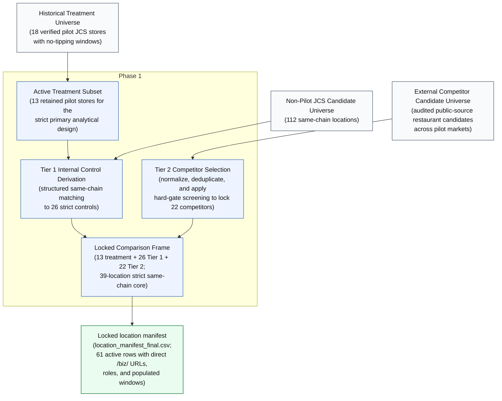

```mermaid
flowchart TD

    T18["Historical Treatment Universe<br/>(18 verified pilot JCS stores<br/>with no-tipping windows)"]:::data
    NP["Non-Pilot JCS Candidate Universe<br/>(112 same-chain locations)"]:::data
    EC["External Competitor Candidate Universe<br/>(audited public-source restaurant candidates<br/>across pilot markets)"]:::data

    subgraph P1["Phase 1"]
        direction TB

        T13["Active Treatment Subset<br/>(13 retained pilot stores for the<br/>strict primary analytical design)"]:::proc

        C1["Tier 1 Internal Control Derivation<br/>(structured same-chain matching<br/>to 26 strict controls)"]:::proc

        C2["Tier 2 Competitor Selection<br/>(normalize, deduplicate, and apply<br/>hard-gate screening to lock 22 competitors)"]:::proc

        FRAME["Locked Comparison Frame<br/>(13 treatment + 26 Tier 1 + 22 Tier 2;<br/>39-location strict same-chain core)"]:::proc

        T13 --> C1 --> FRAME
        C2 --> FRAME
    end

    MAN["Locked location manifest<br/>(location_manifest_final.csv;<br/>61 active rows with direct /biz/ URLs,<br/>roles, and populated windows)"]:::output

    T18 --> T13
    NP --> C1
    EC --> C2
    FRAME --> MAN

    classDef proc fill:#EEF4FF,stroke:#3B6FB6,stroke-width:1.2px,color:#111;
    classDef data fill:#F8FAFC,stroke:#5B6573,stroke-width:1.2px,color:#111;
    classDef output fill:#EAFBF0,stroke:#2E8B57,stroke-width:1.4px,color:#111;

    class T18,NP,EC data;
    class T13,C1,C2,FRAME proc;
    class MAN output;
```
