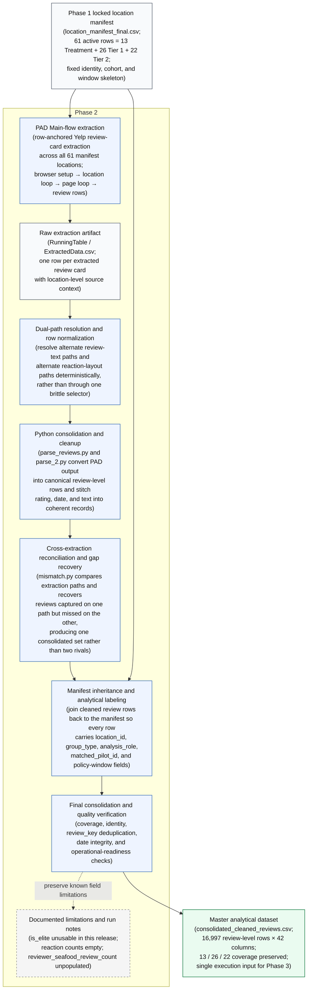

```mermaid
flowchart TD

    %% =========================
    %% EXTERNAL INPUTS
    %% =========================
    MAN["Phase 1 locked location manifest<br/>(location_manifest_final.csv;<br/>61 active rows = 13 Treatment + 26 Tier 1 + 22 Tier 2;<br/>fixed identity, cohort, and window skeleton)"]:::data

    %% =========================
    %% PHASE 2
    %% =========================
    subgraph P2["Phase 2"]
        direction TB

        EXT["PAD Main-flow extraction<br/>(row-anchored Yelp review-card extraction<br/>across all 61 manifest locations;<br/>browser setup → location loop → page loop → review rows)"]:::proc

        RAW["Raw extraction artifact<br/>(RunningTable / ExtractedData.csv;<br/>one row per extracted review card<br/>with location-level source context)"]:::data

        DUAL["Dual-path resolution and row normalization<br/>(resolve alternate review-text paths and<br/>alternate reaction-layout paths deterministically,<br/>rather than through one brittle selector)"]:::proc

        PY["Python consolidation and cleanup<br/>(parse_reviews.py and parse_2.py convert PAD output<br/>into canonical review-level rows and stitch<br/>rating, date, and text into coherent records)"]:::proc

        RECON["Cross-extraction reconciliation and gap recovery<br/>(mismatch.py compares extraction paths and recovers<br/>reviews captured on one path but missed on the other,<br/>producing one consolidated set rather than two rivals)"]:::proc

        INHERIT["Manifest inheritance and analytical labeling<br/>(join cleaned review rows back to the manifest so every row<br/>carries location_id, group_type, analysis_role,<br/>matched_pilot_id, and policy-window fields)"]:::proc

        VERIFY["Final consolidation and quality verification<br/>(coverage, identity, review_key deduplication,<br/>date integrity, and operational-readiness checks)"]:::proc

        QA["Documented limitations and run notes<br/>(is_elite unusable in this release;<br/>reaction counts empty; reviewer_seafood_review_count unpopulated)"]:::note

        EXT --> RAW --> DUAL --> PY --> RECON --> INHERIT --> VERIFY
        VERIFY -. "preserve known field limitations" .-> QA
    end

    MASTER["Master analytical dataset<br/>(consolidated_cleaned_reviews.csv;<br/>16,997 review-level rows × 42 columns;<br/>13 / 26 / 22 coverage preserved;<br/>single execution input for Phase 3)"]:::output

    MAN --> EXT
    MAN --> INHERIT
    VERIFY --> MASTER

    %% =========================
    %% STYLING
    %% =========================
    classDef proc fill:#EEF4FF,stroke:#3B6FB6,stroke-width:1.2px,color:#111;
    classDef data fill:#F8FAFC,stroke:#5B6573,stroke-width:1.2px,color:#111;
    classDef output fill:#EAFBF0,stroke:#2E8B57,stroke-width:1.4px,color:#111;
    classDef note fill:#F5F5F5,stroke:#757575,stroke-width:1px,color:#111,stroke-dasharray: 4 4;

    class MAN,RAW data;
    class EXT,DUAL,PY,RECON,INHERIT,VERIFY proc;
    class MASTER output;
    class QA note;
```
