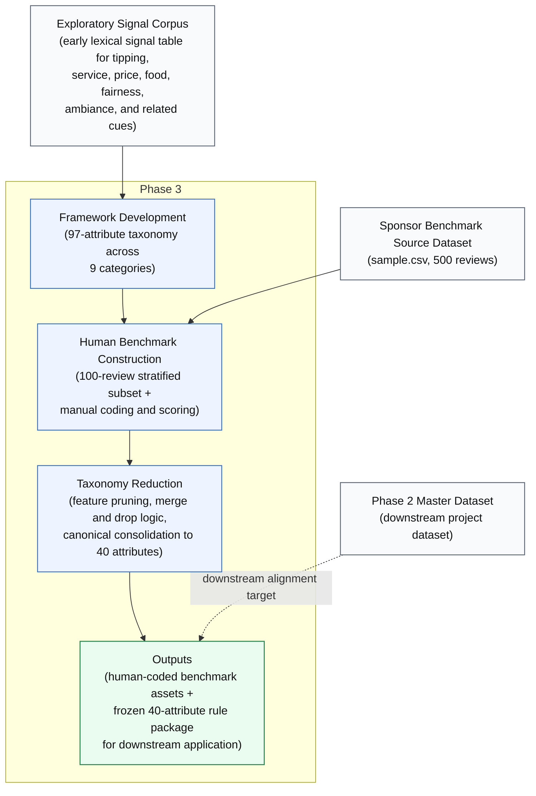

```mermaid
flowchart TD

    C["Exploratory Signal Corpus<br/>(early lexical signal table for tipping,<br/>service, price, food, fairness,<br/>ambiance, and related cues)"]:::data
    S500["Sponsor Benchmark Source Dataset<br/>(sample.csv, 500 reviews)"]:::data
    D["Phase 2 Master Dataset<br/>(downstream project dataset)"]:::data

    subgraph P3["Phase 3"]
        direction TB

        FRAME["Framework Development<br/>(97-attribute taxonomy across<br/>9 categories)"]:::proc

        BENCH["Human Benchmark Construction<br/>(100-review stratified subset +<br/>manual coding and scoring)"]:::proc

        REDUCE["Taxonomy Reduction<br/>(feature pruning, merge and drop logic,<br/>canonical consolidation to 40 attributes)"]:::proc

        OUT["Outputs<br/>(human-coded benchmark assets +<br/>frozen 40-attribute rule package<br/>for downstream application)"]:::output

        FRAME --> BENCH --> REDUCE --> OUT
    end

    C --> FRAME
    S500 --> BENCH
    D -. "downstream alignment target" .-> OUT

    classDef proc fill:#EEF4FF,stroke:#3B6FB6,stroke-width:1.2px,color:#111;
    classDef data fill:#F8FAFC,stroke:#5B6573,stroke-width:1.2px,color:#111;
    classDef output fill:#EAFBF0,stroke:#2E8B57,stroke-width:1.4px,color:#111;

    class C,S500,D data;
    class FRAME,BENCH,REDUCE proc;
    class OUT output;
```
