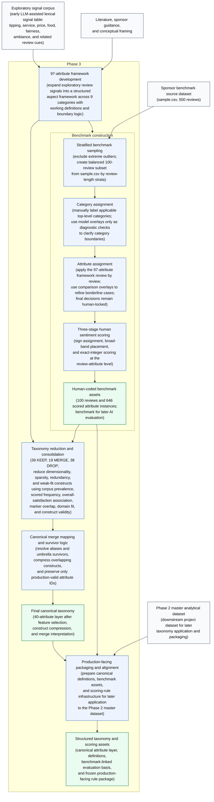

```mermaid
flowchart TD

    %% =========================
    %% EXTERNAL INPUTS
    %% =========================
    C["Exploratory signal corpus<br/>(early LLM-assisted lexical signal table:<br/>tipping, service, price, food, fairness,<br/>ambiance, and related review cues)"]:::data
    LIT["Literature, sponsor guidance,<br/>and conceptual framing"]:::data
    S500["Sponsor benchmark source dataset<br/>(sample.csv, 500 reviews)"]:::data
    D["Phase 2 master analytical dataset<br/>(downstream project dataset for later<br/>taxonomy application and packaging)"]:::data

    %% =========================
    %% PHASE 3
    %% =========================
    subgraph P3["Phase 3"]
        direction TB

        TAX97["97-attribute framework development<br/>(expand exploratory review signals into a structured<br/>aspect framework across 9 categories with<br/>working definitions and boundary logic)"]:::proc

        subgraph BENCH["Benchmark construction"]
            direction TB

            SAMP["Stratified benchmark sampling<br/>(exclude extreme outliers;<br/>create balanced 100-review subset<br/>from sample.csv by review-length strata)"]:::proc

            CAT["Category assignment<br/>(manually label applicable top-level categories;<br/>use model overlays only as diagnostic checks<br/>to clarify category boundaries)"]:::proc

            ATTR["Attribute assignment<br/>(apply the 97-attribute framework review by review;<br/>use comparison overlays to refine borderline cases;<br/>final decisions remain human-locked)"]:::proc

            SCORE["Three-stage human sentiment scoring<br/>(sign assignment, broad-band placement,<br/>and exact-integer scoring at the<br/>review-attribute level)"]:::proc

            GOLD["Human-coded benchmark assets<br/>(100 reviews and 646 scored attribute instances;<br/>benchmark for later AI evaluation)"]:::output

            SAMP --> CAT --> ATTR --> SCORE --> GOLD
        end

        REDUCE["Taxonomy reduction and consolidation<br/>(39 KEEP, 19 MERGE, 38 DROP;<br/>reduce dimensionality, sparsity, redundancy,<br/>and weak-fit constructs using corpus prevalence,<br/>scored frequency, overall-satisfaction association,<br/>marker overlap, domain fit, and construct validity)"]:::proc

        MERGE["Canonical merge mapping and survivor logic<br/>(resolve aliases and umbrella survivors,<br/>compress overlapping constructs,<br/>and preserve only production-valid attribute IDs)"]:::proc

        CANON["Final canonical taxonomy<br/>(40-attribute layer after feature selection,<br/>construct compression, and merge interpretation)"]:::output

        ALIGN["Production-facing packaging and alignment<br/>(prepare canonical definitions, benchmark assets,<br/>and scoring-rule infrastructure for later application<br/>to the Phase 2 master dataset)"]:::proc

        RULES["Structured taxonomy and scoring assets<br/>(canonical attribute layer, definitions,<br/>benchmark-linked evaluation basis,<br/>and frozen production-facing rule package)"]:::output

        TAX97 --> BENCH
        TAX97 --> REDUCE
        GOLD --> REDUCE
        REDUCE --> MERGE --> CANON
        CANON --> ALIGN
        GOLD --> ALIGN
        ALIGN --> RULES
    end

    %% =========================
    %% INPUT FEEDS
    %% =========================
    C --> TAX97
    LIT --> TAX97
    S500 --> SAMP
    D --> ALIGN

    %% =========================
    %% STYLING
    %% =========================
    classDef proc fill:#EEF4FF,stroke:#3B6FB6,stroke-width:1.2px,color:#111;
    classDef data fill:#F8FAFC,stroke:#5B6573,stroke-width:1.2px,color:#111;
    classDef output fill:#EAFBF0,stroke:#2E8B57,stroke-width:1.4px,color:#111;

    class C,LIT,S500,D data;
    class TAX97,SAMP,CAT,ATTR,SCORE,REDUCE,MERGE,ALIGN proc;
    class GOLD,CANON,RULES output;
```
