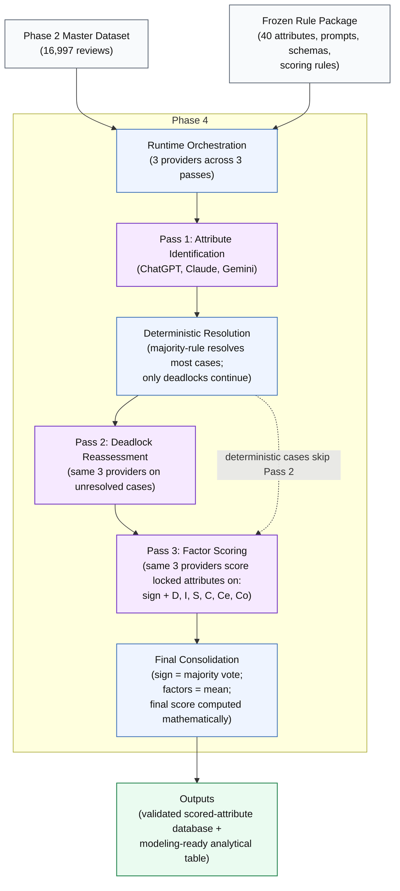

```mermaid
flowchart TD

    D["Phase 2 Master Dataset<br/>(16,997 reviews)"]:::data
    PKG["Frozen Rule Package<br/>(40 attributes, prompts, schemas,<br/>scoring rules)"]:::data

    subgraph P4["Phase 4"]
        direction TB

        ORCH["Runtime Orchestration<br/>(3 providers across 3 passes)"]:::proc

        P1["Pass 1: Attribute Identification<br/>(ChatGPT, Claude, Gemini)"]:::llm

        RES["Deterministic Resolution<br/>(majority-rule resolves most cases;<br/>only deadlocks continue)"]:::proc

        P2["Pass 2: Deadlock Reassessment<br/>(same 3 providers on unresolved cases)"]:::llm

        P3["Pass 3: Factor Scoring<br/>(same 3 providers score locked attributes on:<br/>sign + D, I, S, C, Ce, Co)"]:::llm

        CONS["Final Consolidation<br/>(sign = majority vote;<br/>factors = mean;<br/>final score computed mathematically)"]:::proc

        ORCH --> P1 --> RES --> P2 --> P3 --> CONS
        RES -. "deterministic cases skip Pass 2" .-> P3
    end

    OUT["Outputs<br/>(validated scored-attribute database +<br/>modeling-ready analytical table)"]:::output

    D --> ORCH
    PKG --> ORCH
    CONS --> OUT

    classDef llm fill:#F6E9FF,stroke:#7B3FC6,stroke-width:1.4px,color:#111;
    classDef proc fill:#EEF4FF,stroke:#3B6FB6,stroke-width:1.2px,color:#111;
    classDef data fill:#F8FAFC,stroke:#5B6573,stroke-width:1.2px,color:#111;
    classDef output fill:#EAFBF0,stroke:#2E8B57,stroke-width:1.4px,color:#111;

    class D,PKG data;
    class ORCH,RES,CONS proc;
    class P1,P2,P3 llm;
    class OUT output;
```
