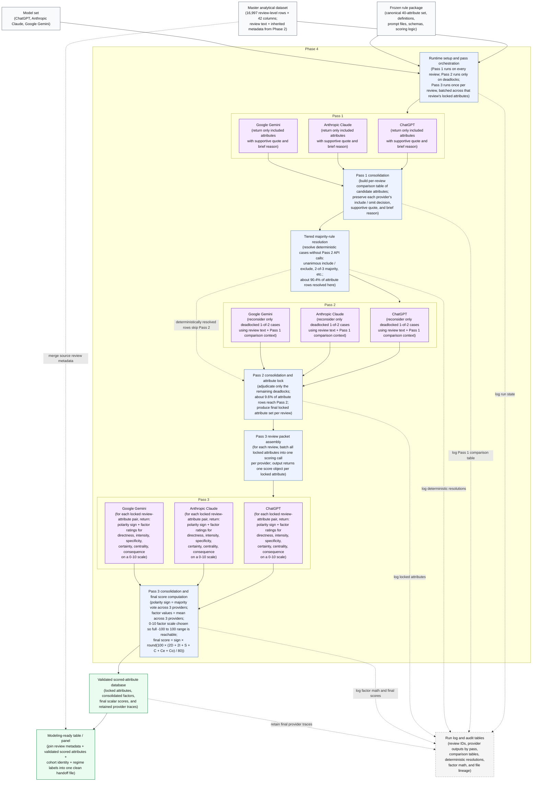

```mermaid
flowchart TD

    %% =========================
    %% EXTERNAL INPUTS
    %% =========================
    D["Master analytical dataset<br/>(16,997 review-level rows × 42 columns;<br/>review text + inherited metadata from Phase 2)"]:::data
    PKG["Frozen rule package<br/>(canonical 40-attribute set, definitions,<br/>prompt files, schemas, scoring logic)"]:::data
    MODELSET["Model set<br/>(ChatGPT, Anthropic Claude, Google Gemini)"]:::data

    %% =========================
    %% PHASE 4
    %% =========================
    subgraph P4["Phase 4"]
        direction TB

        ORCH["Runtime setup and pass orchestration<br/>(Pass 1 runs on every review; Pass 2 runs only on deadlocks;<br/>Pass 3 runs once per review, batched across that review's locked attributes)"]:::proc

        subgraph PASS1["Pass 1"]
            direction LR
            P1A["ChatGPT<br/>(return only included attributes<br/>with supportive quote and brief reason)"]:::llm
            P1B["Anthropic Claude<br/>(return only included attributes<br/>with supportive quote and brief reason)"]:::llm
            P1C["Google Gemini<br/>(return only included attributes<br/>with supportive quote and brief reason)"]:::llm
        end

        CONS1["Pass 1 consolidation<br/>(build per-review comparison table of candidate attributes;<br/>preserve each provider's include / omit decision,<br/>supportive quote, and brief reason)"]:::proc

        TIER["Tiered majority-rule resolution<br/>(resolve deterministic cases without Pass 2 API calls:<br/>unanimous include / exclude, 2-of-3 majority, etc.;<br/>about 90.4% of attribute rows resolved here)"]:::proc

        subgraph PASS2["Pass 2"]
            direction LR
            P2A["ChatGPT<br/>(reconsider only deadlocked 1-of-2 cases<br/>using review text + Pass 1 comparison context)"]:::llm
            P2B["Anthropic Claude<br/>(reconsider only deadlocked 1-of-2 cases<br/>using review text + Pass 1 comparison context)"]:::llm
            P2C["Google Gemini<br/>(reconsider only deadlocked 1-of-2 cases<br/>using review text + Pass 1 comparison context)"]:::llm
        end

        CONS2["Pass 2 consolidation and attribute lock<br/>(adjudicate only the remaining deadlocks;<br/>about 9.6% of attribute rows reach Pass 2;<br/>produce final locked attribute set per review)"]:::proc

        P3PACK["Pass 3 review packet assembly<br/>(for each review, batch all locked attributes into one scoring call<br/>per provider; output returns one score object per locked attribute)"]:::proc

        subgraph PASS3["Pass 3"]
            direction LR
            P3A["ChatGPT<br/>(for each locked review-attribute pair, return:<br/>polarity sign + factor ratings for<br/>directness, intensity, specificity,<br/>certainty, centrality, consequence<br/>on a 0-10 scale)"]:::llm
            P3B["Anthropic Claude<br/>(for each locked review-attribute pair, return:<br/>polarity sign + factor ratings for<br/>directness, intensity, specificity,<br/>certainty, centrality, consequence<br/>on a 0-10 scale)"]:::llm
            P3C["Google Gemini<br/>(for each locked review-attribute pair, return:<br/>polarity sign + factor ratings for<br/>directness, intensity, specificity,<br/>certainty, centrality, consequence<br/>on a 0-10 scale)"]:::llm
        end

        CONS3["Pass 3 consolidation and final score computation<br/>(polarity sign = majority vote across 3 providers;<br/>factor values = mean across 3 providers;<br/>0-10 factor scale chosen so full -100 to 100 range is reachable;<br/>final score = sign × round(100 × (2D + 2I + S + C + Ce + Co) / 80))"]:::proc

        ORCH --> PASS1
        P1A --> CONS1
        P1B --> CONS1
        P1C --> CONS1

        CONS1 --> TIER
        TIER --> PASS2
        P2A --> CONS2
        P2B --> CONS2
        P2C --> CONS2

        TIER -. "deterministically resolved rows skip Pass 2" .-> CONS2
        CONS2 --> P3PACK --> PASS3

        P3A --> CONS3
        P3B --> CONS3
        P3C --> CONS3
    end

    WB["Validated scored-attribute database<br/>(locked attributes, consolidated factors,<br/>final scalar scores, and retained provider traces)"]:::output

    M["Modeling-ready table / panel<br/>(join review metadata + validated scored attributes +<br/>cohort identity + regime labels into one clean handoff file)"]:::output

    AUDIT["Run log and audit tables<br/>(review IDs, provider outputs by pass,<br/>comparison tables, deterministic resolutions,<br/>factor math, and file lineage)"]:::note

    CONS3 --> WB --> M
    D -. "merge source review metadata" .-> M

    ORCH -. "log run state" .-> AUDIT
    CONS1 -. "log Pass 1 comparison table" .-> AUDIT
    TIER -. "log deterministic resolutions" .-> AUDIT
    CONS2 -. "log locked attributes" .-> AUDIT
    CONS3 -. "log factor math and final scores" .-> AUDIT
    WB -. "retain final provider traces" .-> AUDIT

    %% =========================
    %% INPUT FEEDS
    %% =========================
    D --> ORCH
    PKG --> ORCH
    MODELSET --> ORCH

    %% =========================
    %% STYLING
    %% =========================
    classDef llm fill:#F6E9FF,stroke:#7B3FC6,stroke-width:1.4px,color:#111;
    classDef proc fill:#EEF4FF,stroke:#3B6FB6,stroke-width:1.2px,color:#111;
    classDef data fill:#F8FAFC,stroke:#5B6573,stroke-width:1.2px,color:#111;
    classDef output fill:#EAFBF0,stroke:#2E8B57,stroke-width:1.4px,color:#111;
    classDef note fill:#F5F5F5,stroke:#757575,stroke-width:1px,color:#111,stroke-dasharray: 4 4;

    class D,PKG,MODELSET data;
    class ORCH,CONS1,TIER,CONS2,P3PACK,CONS3 proc;
    class P1A,P1B,P1C,P2A,P2B,P2C,P3A,P3B,P3C llm;
    class WB,M output;
    class AUDIT note;
```
