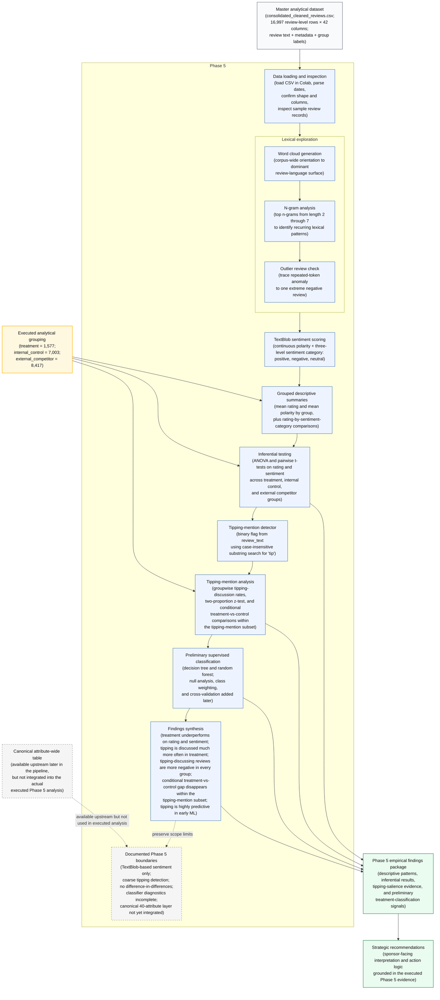

```mermaid
flowchart TD

    %% =========================
    %% EXTERNAL INPUTS
    %% =========================
    D["Master analytical dataset<br/>(consolidated_cleaned_reviews.csv;<br/>16,997 review-level rows × 42 columns;<br/>review text + metadata + group labels)"]:::data

    G["Executed analytical grouping<br/>(treatment = 1,577;<br/>internal_control = 7,003;<br/>external_competitor = 8,417)"]:::cohort

    WIDE["Canonical attribute-wide table<br/>(available upstream later in the pipeline,<br/>but not integrated into the actual<br/>executed Phase 5 analysis)"]:::note

    %% =========================
    %% PHASE 5
    %% =========================
    subgraph P5["Phase 5"]
        direction TB

        LOAD["Data loading and inspection<br/>(load CSV in Colab, parse dates,<br/>confirm shape and columns,<br/>inspect sample review records)"]:::proc

        subgraph LEX["Lexical exploration"]
            direction TB

            WC["Word cloud generation<br/>(corpus-wide orientation to dominant<br/>review-language surface)"]:::proc

            NGRAM["N-gram analysis<br/>(top n-grams from length 2 through 7<br/>to identify recurring lexical patterns)"]:::proc

            OUTLIER["Outlier review check<br/>(trace repeated-token anomaly<br/>to one extreme negative review)"]:::proc

            WC --> NGRAM --> OUTLIER
        end

        SENT["TextBlob sentiment scoring<br/>(continuous polarity + three-level sentiment category:<br/>positive, negative, neutral)"]:::proc

        GROUPSUM["Grouped descriptive summaries<br/>(mean rating and mean polarity by group,<br/>plus rating-by-sentiment-category comparisons)"]:::proc

        INF["Inferential testing<br/>(ANOVA and pairwise t-tests on rating and sentiment<br/>across treatment, internal control,<br/>and external competitor groups)"]:::proc

        TIPFLAG["Tipping-mention detector<br/>(binary flag from review_text<br/>using case-insensitive substring search for 'tip')"]:::proc

        TIPTEST["Tipping-mention analysis<br/>(groupwise tipping-discussion rates,<br/>two-proportion z-test, and conditional<br/>treatment-vs-control comparisons within<br/>the tipping-mention subset)"]:::proc

        ML["Preliminary supervised classification<br/>(decision tree and random forest;<br/>null analysis, class weighting,<br/>and cross-validation added later)"]:::proc

        SYN["Findings synthesis<br/>(treatment underperforms on rating and sentiment;<br/>tipping is discussed much more often in treatment;<br/>tipping-discussing reviews are more negative in every group;<br/>conditional treatment-vs-control gap disappears within the<br/>tipping-mention subset; tipping is highly predictive in early ML)"]:::proc

        LIMITS["Documented Phase 5 boundaries<br/>(TextBlob-based sentiment only;<br/>coarse tipping detection; no difference-in-differences;<br/>classifier diagnostics incomplete;<br/>canonical 40-attribute layer not yet integrated)"]:::note

        LOAD --> LEX --> SENT --> GROUPSUM --> INF
        INF --> TIPFLAG --> TIPTEST --> ML --> SYN
        SYN -. "preserve scope limits" .-> LIMITS
    end

    FIND["Phase 5 empirical findings package<br/>(descriptive patterns, inferential results,<br/>tipping-salience evidence, and preliminary<br/>treatment-classification signals)"]:::output

    REC["Strategic recommendations<br/>(sponsor-facing interpretation and action logic<br/>grounded in the executed Phase 5 evidence)"]:::output

    %% =========================
    %% INPUT FEEDS
    %% =========================
    D --> LOAD
    G --> GROUPSUM
    G --> INF
    G --> TIPTEST
    WIDE -. "available upstream but not used in executed analysis" .-> LIMITS

    %% =========================
    %% OUTPUT LINKS
    %% =========================
    INF --> FIND
    TIPTEST --> FIND
    ML --> FIND
    SYN --> FIND
    FIND --> REC

    %% =========================
    %% STYLING
    %% =========================
    classDef proc fill:#EEF4FF,stroke:#3B6FB6,stroke-width:1.2px,color:#111;
    classDef data fill:#F8FAFC,stroke:#5B6573,stroke-width:1.2px,color:#111;
    classDef cohort fill:#FFF8E1,stroke:#FFB300,stroke-width:1.5px,color:#111;
    classDef output fill:#EAFBF0,stroke:#2E8B57,stroke-width:1.4px,color:#111;
    classDef note fill:#F5F5F5,stroke:#757575,stroke-width:1px,color:#111,stroke-dasharray: 4 4;

    class D data;
    class G cohort;
    class LOAD,WC,NGRAM,OUTLIER,SENT,GROUPSUM,INF,TIPFLAG,TIPTEST,ML,SYN proc;
    class FIND,REC output;
    class WIDE,LIMITS note;
```
