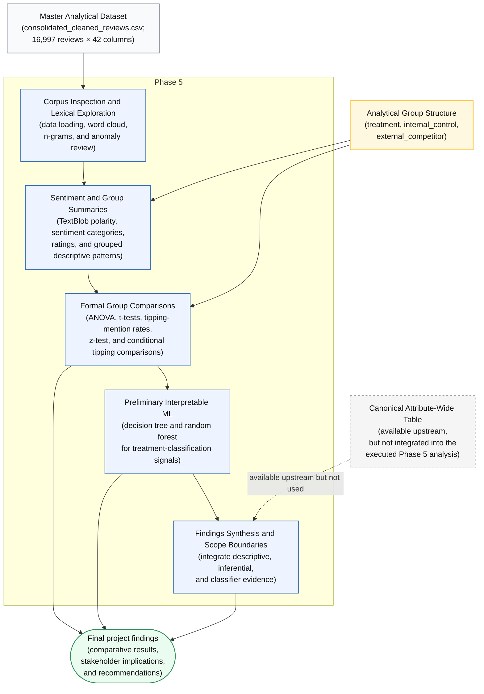

```mermaid
flowchart TD

    D["Master Analytical Dataset<br/>(consolidated_cleaned_reviews.csv;<br/>16,997 reviews × 42 columns)"]:::data

    G["Analytical Group Structure<br/>(treatment, internal_control,<br/>external_competitor)"]:::cohort

    WIDE["Canonical Attribute-Wide Table<br/>(available upstream,<br/>but not integrated into the<br/>executed Phase 5 analysis)"]:::note

    subgraph P5["Phase 5"]
        direction TB

        DESC["Corpus Inspection and Lexical Exploration<br/>(data loading, word cloud,<br/>n-grams, and anomaly review)"]:::proc

        SENT["Sentiment and Group Summaries<br/>(TextBlob polarity, sentiment categories,<br/>ratings, and grouped descriptive patterns)"]:::proc

        TEST["Formal Group Comparisons<br/>(ANOVA, t-tests, tipping-mention rates,<br/>z-test, and conditional tipping comparisons)"]:::proc

        ML["Preliminary Interpretable ML<br/>(decision tree and random forest<br/>for treatment-classification signals)"]:::proc

        SYN["Findings Synthesis and Scope Boundaries<br/>(integrate descriptive, inferential,<br/>and classifier evidence)"]:::proc

        DESC --> SENT --> TEST --> ML --> SYN
    end

    OUT(["Final project findings<br/>(comparative results,<br/>stakeholder implications,<br/>and recommendations)"]):::output

    D --> DESC
    G --> SENT
    G --> TEST
    TEST --> OUT
    ML --> OUT
    SYN --> OUT
    WIDE -. "available upstream but not used" .-> SYN

    classDef proc fill:#EEF4FF,stroke:#3B6FB6,stroke-width:1.2px,color:#111;
    classDef data fill:#F8FAFC,stroke:#5B6573,stroke-width:1.2px,color:#111;
    classDef cohort fill:#FFF8E1,stroke:#FFB300,stroke-width:1.5px,color:#111;
    classDef output fill:#EAFBF0,stroke:#2E8B57,stroke-width:1.4px,color:#111;
    classDef note fill:#F5F5F5,stroke:#757575,stroke-width:1px,color:#111,stroke-dasharray: 4 4;

    class D data;
    class G cohort;
    class DESC,SENT,TEST,ML,SYN proc;
    class OUT output;
    class WIDE note;
```
